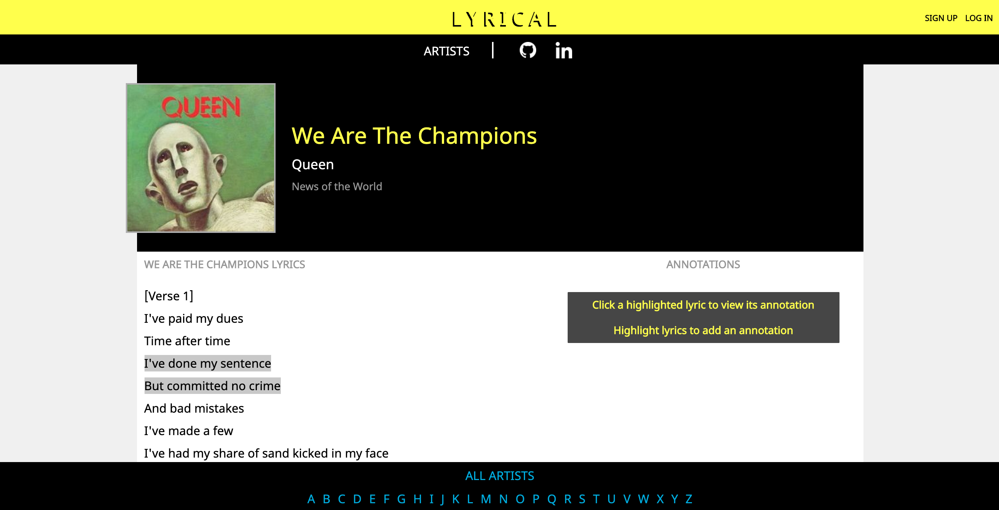
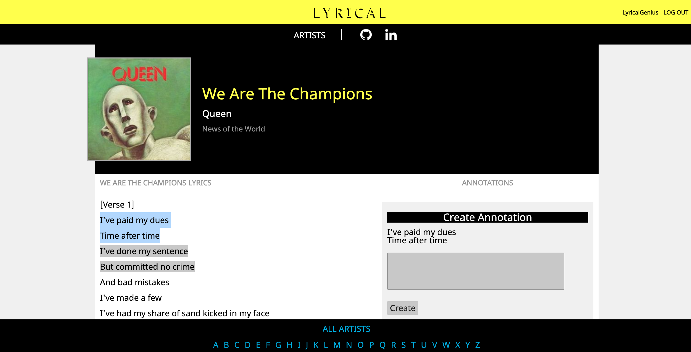

# [Lyrical](https://get-lyrical.herokuapp.com)

Lyrical is a single-page application clone of genius.com which allows users to annotate song lyrics with additional information.

## Technologies

Lyrical was created with a Ruby on Rails backend, PostgreSQL database, and React.js with Redux for the front end.

Addtionally, JBuilder was used to create API responses and AWS S3 cloud storage was used to store images remotely.

## Features

### Annotations


Implementing the annotations feature presented some challenges, particularly on the front end. Users can create new annotations by highlighting the text that they would like to annotate. A form then appears with a field for users to add an annotation.


This was implemented using `onmousedown` and `onmouseup` event handlers on the lyrics body.

The lyrics text is subdivided into `span` and `a` elements based on existing annotations, so the `onmousedown` handler stores in local state the element that the selection started in. `onmouseup` then finds the beginning and ending indexes of the user's selection and sets the smaller to the start_index and the larger to the end_index in local state, as well as setting `activeAnnotation` state to render the Annotation form.


```javascript
handleMouseDown(e) {
        this.setState({mouseDownElement: e.target})
    }

handleMouseUp(e) {
    let startOffset = parseInt(this.state.mouseDownElement.getAttribute('data-indexoffset'));
    let endOffset = parseInt(e.target.getAttribute('data-indexoffset'));
    let startIndex = (startOffset + window.getSelection().anchorOffset);
    let endIndex = (endOffset + window.getSelection().focusOffset)
    
    let minIndex = Math.min(startIndex, endIndex)
    let maxIndex = Math.max(startIndex, endIndex)

    
    if (maxIndex - minIndex > 0) {
        if (this.props.annotations.length) {
            let safe = true;
            for (let i = 0; i < this.props.annotations.length; i++) {
                const annotation = this.props.annotations[i];
    
                if ((annotation.startIndex >= minIndex) && (annotation.endIndex <= maxIndex)) {
                    safe = false
                }
            }
            if (safe) {
                this.setState({
                    startIndex: minIndex,
                    endIndex: maxIndex,
                    mouseDownElement: null,
                    activeAnnotation: 'create'
                })
            } else {
                this.setState({
                    mouseDownElement: null,
                    activeAnnotation: null
                })
            }

            
        } else {
            this.setState({
                startIndex: minIndex,
                endIndex: maxIndex,
                mouseDownElement: null,
                activeAnnotation: 'create'
            })
        }
    } else {
        this.setState({
            mouseDownElement: null,
            activeAnnotation: null,
        })
    }

}
```