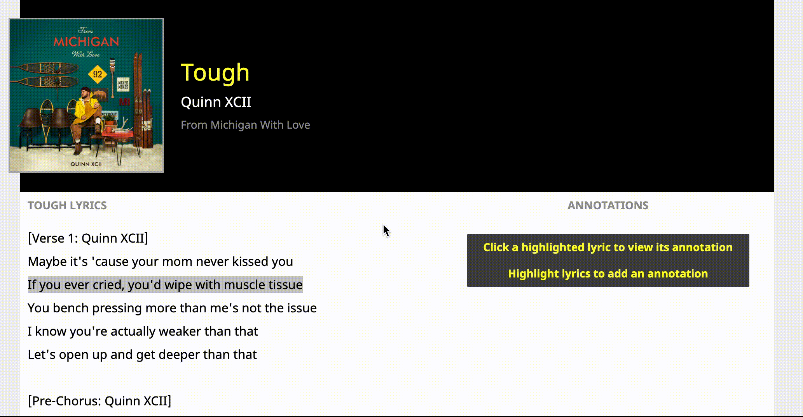
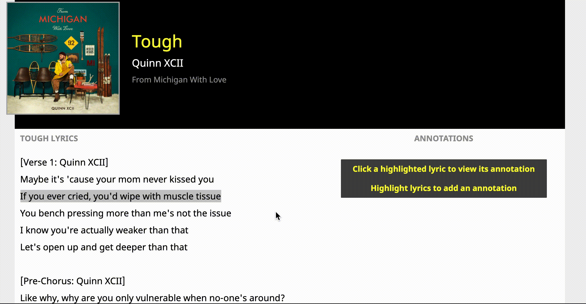

# [Lyrical](https://get-lyrical.herokuapp.com)

Lyrical is a single-page application based on genius.com which allows users to annotate song lyrics with additional information.

## Technologies

Lyrical was created with a Ruby on Rails backend, PostgreSQL database, and React.js with Redux for the front end.

Addtionally, JBuilder was used to create API responses and AWS S3 cloud storage was used to store images remotely.
</br>
</br>

## Annotations


Users can create new annotations by highlighting the text that they would like to annotate. A form then appears with a field for users to add an annotation.


This was implemented using `onMouseDown` and `onMouseUp` event handlers on the lyrics body.

The lyrics text is rendered in a single `p` element. This element is then subdivided into `span` and `a` elements based on existing annotations. The `onMouseDown` handler (`handleMouseDown`) stores the element that the selection started in, `e.target`, as well as clearing the sidebar if the editor or another annotation is open.  

```javascript
// frontend/components/track/track_show.jsx

handleMouseDown(e) {
    this.setState({
        activeAnnotation: null,
        mouseDownElement: e.target
    }) 
}
```
</br>
</br>

The `onMouseUp` handler (`handleMouseUp`) then finds the beginning and ending indices of the user's selection and, provided the selection does not overlap an existing annotation, sets the smaller to the start_index and the larger to the end_index in local state. `activeAnnotation` is also set to `'create'`in local state which triggers the render the Annotation form. Additionally, the `mouseDownElement` is cleared to allow for subsequent selections.


```javascript
// frontend/components/track/track_show.jsx

handleMouseUp(e) {
    let startOffset = parseInt(this.state.mouseDownElement.getAttribute('data-indexoffset'));
    let endOffset = parseInt(e.target.getAttribute('data-indexoffset'));
    let startIndex = (startOffset + window.getSelection().anchorOffset);
    let endIndex = (endOffset + window.getSelection().focusOffset)

    let minIndex = Math.min(startIndex, endIndex)
    let maxIndex = Math.max(startIndex, endIndex)

    if (maxIndex - minIndex > 0) {
        let safe = true;
        for (let i = 0; i < this.props.annotations.length; i++) {
            const annotation = this.props.annotations[i];

            if ((annotation.startIndex >= minIndex) && (annotation.endIndex <= maxIndex)) {
                safe = false
            }
        }
        if (safe) {
            this.setState({
                startIndex: minIndex,
                endIndex: maxIndex,
                mouseDownElement: null,
                activeAnnotation: 'create'
            })
        } else {
            this.clearAnnotation()
        }
    } else {
        this.clearAnnotation()
    }
}
```
